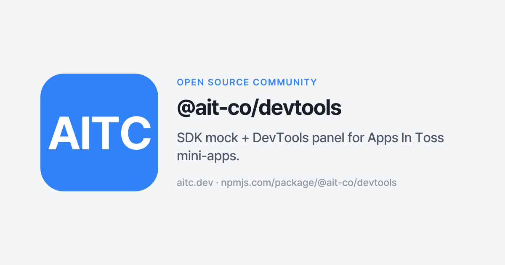

# @ait-co/devtools

**한국어** · [English](./README.en.md)

[](https://www.npmjs.com/package/@ait-co/devtools) [](./LICENSE)



`@apps-in-toss/web-framework` SDK의 mock 라이브러리입니다. `@apps-in-toss/webview-bridge` import도 unplugin이 함께 인터셉트합니다(high-level SDK 함수만 노출 — bridge primitive는 미노출). (2.x의 `@apps-in-toss/web-bridge`, `@apps-in-toss/web-analytics`도 back-compat으로 지원.)

앱인토스(Apps in Toss) 미니앱을 **일반 브라우저**에서 개발하고 테스트할 수 있게 해줍니다. 토스 앱 없이도 SDK의 모든 기능을 시뮬레이션하여 빠른 개발 사이클을 지원합니다.

- **60+ SDK API mock** — 인증, 결제, IAP, 위치, 카메라, 스토리지 등
- **Device API 모드 시스템** — mock / web / prompt 세 가지 모드로 디바이스 API 동작 전환
- **Device simulation** — iPhone/Galaxy 프리셋 + orientation 토글로 데스크탑 브라우저에서 모바일 뷰포트 시뮬레이션
- **Floating DevTools Panel** — 브라우저에서 SDK 상태를 실시간으로 제어 (12개 탭, mock state preset library 포함)
- **모든 번들러 지원** — [unplugin](https://github.com/unjs/unplugin) 기반 Vite, Webpack, Rspack, esbuild, Rollup 통합

라이브 데모: <https://devtools.aitc.dev/> (이 repo의 `e2e/fixture/`를 GitHub Pages에 그대로 배포한 self-contained 데모).

## 15초 quickstart — 내 상황에 맞는 환경 고르기

4가지 실행 환경이 있습니다. 지금 상황에 맞는 카드 하나를 고르고, 해당 상세 시나리오 문서로 이동하세요.

---

**환경 1 — 로컬 브라우저** (가장 빠름, HMR O)

데스크탑 Chrome에서 mock SDK + DevTools 패널로 개발합니다. 토스 앱·폰 없이 즉시 시작.

```bash
pnpm add -D @ait-co/devtools
# vite.config.ts에 unplugin 추가 → pnpm dev
```

DevTools 패널: 화면 우하단 **AIT** 버튼. 상세: [`docs/scenarios/env-1.md`](./docs/scenarios/env-1.md)

---

**환경 2 — 실기기 PWA** (실 WebKit 엔진, HMR O, 토스 검수 불필요)

폰에서 실기기 Safari/WebKit 엔진으로 미니앱을 확인합니다. launcher PWA를 한 번 설치하고, 매 세션마다 QR 스캔.

```bash
# vite.config.ts에 tunnel 옵션 추가 후:
pnpm dev:phone          # AIT_TUNNEL=1 pnpm dev 와 동일
# 터미널에 QR 출력 → 폰 카메라로 스캔 → launcher PWA에서 자동 열림
```

`tunnel: { cdp: true }`를 켜면 같은 QR 한 번으로 화면 미리보기 + on-device CDP가 함께 열려 실기기 WebKit의 DOM·콘솔·예외를 MCP로 관측합니다 (`call_sdk`는 환경 2에서 mock — 실 SDK는 환경 3·4).

사전: 폰에 `https://devtools.aitc.dev/launcher/` 를 홈 화면에 한 번 추가. 상세: [`docs/scenarios/env-2.md`](./docs/scenarios/env-2.md)

---

**환경 3 — intoss-private** (토스 WebView, HMR X, debug 전용)

실기기 토스 앱 WebView에서 dogfood 번들을 로드하고 MCP relay로 디버깅합니다.

```bash
devtools-mcp              # MCP 서버 시작 → QR 출력
# ait build && ait deploy --scheme-only
# build_attach_url 호출 → QR 스캔 → 토스 앱 로드 + relay attach
```

HMR 없음(토스 WebView cold-load만). 상세: [`docs/scenarios/env-3.md`](./docs/scenarios/env-3.md)

---

**환경 4 — 배포된 앱 (LIVE)** (검수 통과 앱, HMR X, read-only debug)

검수를 통과하고 OPENED 상태인 실 출시 앱에 relay를 붙여 런타임을 관측합니다.

```bash
MCP_ENV=relay-live devtools-mcp   # MCP 서버 시작 (LIVE guard 활성화)
# build_attach_url 호출 → QR 스캔 → LIVE 앱 로드 + relay attach
# call_sdk / evaluate 는 confirm: true 필수 (LIVE guard — 실유저 영향)
```

`MCP_ENV=relay-live` 필수 — 미설정 시 LIVE side-effect guard가 비활성화되어 실유저에게 영향을 줄 수 있습니다. 상세: [`docs/scenarios/env-4.md`](./docs/scenarios/env-4.md)

---

## 자주 겪는 문제 5가지

**"QR 창이 안 열림"**

`build_attach_url`을 먼저 호출하지 않았거나, GUI 없는 headless 환경에서 `open_in_browser`가 실패한 경우입니다. 터미널에 PNG 저장 경로가 출력됩니다 — 그 파일을 직접 열거나, 텍스트 QR을 터미널에서 스캔하세요. (관련: [#288](https://github.com/apps-in-toss-community/devtools/issues/288))

**"page 미attach" — list_pages가 빈 배열 반환**

relay에 붙은 페이지가 없는 상태입니다. `build_attach_url` → QR 스캔 순서로 폰을 다시 진입시키세요. MCP 에러 메시지가 "페이지가 attach 안 됨. build_attach_url → QR 스캔."으로 뜨면 이 케이스입니다.

**"tunnel down" — 터널 응답 없음 또는 timeout**

cloudflared quick tunnel은 수 시간 후 drop될 수 있습니다. `devtools-mcp` 프로세스를 재시작하면 새 tunnel URL이 발급됩니다. 재발급 후 QR을 다시 스캔하세요. (관련: [#290](https://github.com/apps-in-toss-community/devtools/issues/290))

**"page crash" — list_pages에 crashDetectedAt이 찍힘**

폰 측 페이지가 OOM·JS exception·native bridge crash로 죽은 상태입니다. 앱을 재실행 후 `build_attach_url` → QR 스캔으로 다시 attach하세요. (관련: [#265](https://github.com/apps-in-toss-community/devtools/issues/265))

**"SDK 부재" — window.__sdkCall 미주입**

`call_sdk` 호출 시 `ok: false, error: "window.__sdkCall is not available"` 에러가 뜨면 dogfood 빌드가 아닌 일반 번들이 로드된 것입니다. `__DEBUG_BUILD__` 플래그가 켜진 dogfood 채널로 재배포 후 다시 시도하세요. 환경 2(PWA)에서는 이 에러가 예상 결과입니다. (관련: [#285](https://github.com/apps-in-toss-community/devtools/issues/285))

**"QR 스캔했는데 인증 실패" — TOTP 만료**

`AIT_DEBUG_TOTP_SECRET` 설정 시 `build_attach_url`이 반환하는 attachUrl에는 30초 유효 TOTP 코드(`at=`)가 자동으로 포함됩니다. 응답의 `totp.expiresAt` 이후 스캔하면 relay가 인증을 거부합니다. 해결: `build_attach_url`을 재호출해 새 URL과 QR을 발급받은 뒤 30초 이내에 스캔하세요.

---

## 설치

```bash
npm install -D @ait-co/devtools
# 또는
pnpm add -D @ait-co/devtools
```

> **지원 SDK 버전**: `@apps-in-toss/web-framework 3.0.0-beta.9d42c0b` (beta, peer optional).
>
> 현재 devtools는 web-framework **3.0.0-beta** 프리릴리즈를 추적합니다. beta 버전은 `^3.0.0`으로 resolve되지 않으므로 설치 시 exact pin(`@apps-in-toss/web-framework@3.0.0-beta.9d42c0b`)을 사용하세요. stable 3.0.0 GA 출시 후 peer range와 pin이 업데이트됩니다. devtools가 아직 mock하지 않은 API를 호출하면 런타임에 에러가 발생합니다 — 누락된 API는 [이슈](https://github.com/apps-in-toss-community/devtools/issues)로 알려주세요.

## Reference consumer

[`sdk-example`](https://github.com/apps-in-toss-community/sdk-example)이 devtools의 reference consumer다. 모든 SDK API를 인터랙티브하게 실행해볼 수 있는 카탈로그 앱으로, 웹 데모는 <https://sdk-example.aitc.dev/>에서 바로 확인할 수 있다. 새 mock을 추가하면 sdk-example의 카드에서 그대로 동작하는 게 1차 sanity check. 단, 이 repo의 E2E suite는 sdk-example을 clone하지 않고 **내부 자기완결 fixture(`e2e/fixture/`)** 로 운영한다 — sdk-example이 깨져도 devtools CI는 영향받지 않는다.

## 번들러 설정

### Vite

```ts
// vite.config.ts (개발 전용)
import aitDevtools from '@ait-co/devtools/unplugin';

export default {
  plugins: [aitDevtools.vite()],
};
```

> 개발 전용 설정입니다. Production 빌드에서 제외하려면 아래 [Production 빌드](#production-빌드) 섹션을 참고하세요.

### Webpack / Rspack

```js
// webpack.config.js (ESM, 개발 환경에서만 사용 권장)
import aitDevtools from '@ait-co/devtools/unplugin';
config.plugins.push(aitDevtools.webpack());

// webpack.config.js (CommonJS)
const aitDevtools = require('@ait-co/devtools/unplugin');
config.plugins.push(aitDevtools.webpack());
```

### Next.js (Turbopack)

Turbopack은 플러그인 시스템을 지원하지 않으므로 `resolveAlias`를 사용합니다.

- `@apps-in-toss/web-framework` 하나만 alias하면 됩니다. SDK 호출은 모두 이 패키지를 거치므로, mock으로 치환하면 web-framework 모듈 자체가 모듈 그래프에서 빠지고, 그 안의 `@apps-in-toss/webview-bridge` import도 함께 사라집니다.
- Turbopack은 일반적으로 `next dev`에서만 사용되므로 별도의 production 가드가 필요하지 않습니다.

```js
// next.config.js (Next.js 15+, web-framework 3.0+)
module.exports = {
  turbo: {
    resolveAlias: {
      '@apps-in-toss/web-framework': '@ait-co/devtools/mock',
    },
  },
};
```

Next.js 14 이하에서는 `experimental.turbo`를 사용합니다:

```js
// next.config.js (Next.js 14 이하, web-framework 3.0+)
module.exports = {
  experimental: {
    turbo: {
      resolveAlias: {
        '@apps-in-toss/web-framework': '@ait-co/devtools/mock',
      },
    },
  },
};
```

> **Panel 주입**: Turbopack은 unplugin을 지원하지 않으므로 Panel이 자동 주입되지 않습니다. 진입점에서 직접 import하세요:
> ```ts
> // app/layout.tsx 또는 pages/_app.tsx
> import '@ait-co/devtools/panel';
> ```

### Next.js (Webpack)

Next.js에서 Webpack 모드(`next dev` without `--turbo`, 또는 `next build`)를 사용하는 경우:

```js
// next.config.js (Webpack 모드)
const aitDevtools = require('@ait-co/devtools/unplugin'); // CJS entrypoint 제공

module.exports = {
  webpack: (config, { dev }) => {
    if (dev) {
      config.plugins.push(aitDevtools.webpack());
    }
    return config;
  },
};
```

### 수동 Alias 설정

번들러의 `resolve.alias` 설정으로 직접 지정할 수도 있습니다:

```ts
// vite.config.ts (web-framework 3.0+)
import { defineConfig } from 'vite';

export default defineConfig({
  resolve: {
    alias: {
      '@apps-in-toss/web-framework': '@ait-co/devtools/mock',
    },
  },
});
```

```js
// webpack.config.js (Webpack은 절대 경로 필요, web-framework 3.0+)
module.exports = {
  resolve: {
    alias: {
      '@apps-in-toss/web-framework': require.resolve('@ait-co/devtools/mock'),
    },
  },
};
```

> **주의**: 수동 alias만 사용하면 DevTools Panel이 자동 주입되지 않습니다. 진입점 파일에 직접 import를 추가하세요:
> ```ts
> import '@ait-co/devtools/panel'; // 진입점에 추가
> ```

### 플러그인 옵션

| 옵션 | 타입 | 기본값 | 설명 |
|---|---|---|---|
| `panel` | `boolean` | `true` | DevTools Panel 자동 주입 여부 |
| `forceEnable` | `boolean` | `false` | production에서도 devtools 활성화 |
| `mock` | `boolean` | `true` (dev) / `false` (prod+forceEnable) | mock alias 활성화 여부 |
| `mcp` | `boolean` | `false` | Vite dev server에 MCP state endpoint 추가 (Vite 전용, [MCP 섹션](#mcp-server) 참조) |
| `tunnel` | `boolean \| { port?: number; qr?: boolean; cdp?: boolean }` | `false` | Vite dev 서버를 Cloudflare quick tunnel로 노출 (실기기 미리보기, [아래](#run-on-a-real-phone-실기기-미리보기) 참고). `cdp: true`면 환경 2 PWA에 on-device CDP 디버깅도 배선. **Vite dev 모드 전용** |

```ts
aitDevtools.vite({ panel: false }); // Panel 없이 mock만 사용
aitDevtools.vite({ forceEnable: true }); // production에서도 활성화 (mock 기본 OFF, panel ON)
aitDevtools.vite({ forceEnable: true, mock: true }); // production에서 mock도 활성화
aitDevtools.vite({ mcp: true }); // AI 에이전트용 MCP endpoint 활성화
aitDevtools.vite({ tunnel: true }); // dev 서버를 *.trycloudflare.com으로 노출
aitDevtools.vite({ tunnel: { cdp: true } }); // 실기기 미리보기 + on-device CDP 디버깅
```

## Production 빌드

기본적으로 devtools 플러그인은 **production 빌드에서 자동 비활성화**됩니다 (`NODE_ENV === 'production'`이면 alias 변환과 Panel 주입이 모두 스킵). 별도의 조건부 설정 없이도 안전합니다.

스테이징 환경 등에서 production 빌드에서도 devtools를 사용하려면 `forceEnable` 옵션을 사용하세요:

```ts
aitDevtools.vite({ forceEnable: true }); // panel ON, mock OFF (모니터링 전용)
aitDevtools.vite({ forceEnable: true, mock: true }); // panel + mock 모두 ON
```

번들러 설정에서 플러그인 자체를 조건부로 제외할 수도 있습니다:

```ts
// vite.config.ts
import { defineConfig } from 'vite';
import aitDevtools from '@ait-co/devtools/unplugin';

export default defineConfig(({ command }) => ({
  plugins: [
    ...(command === 'serve' ? [aitDevtools.vite()] : []),
  ],
}));
```

```js
// webpack.config.js (Rspack도 동일)
const aitDevtools = require('@ait-co/devtools/unplugin');
const plugins = [];
if (process.env.NODE_ENV !== 'production') {
  plugins.push(aitDevtools.webpack());
}
```

> Next.js 설정은 위의 [Next.js (Webpack)](#nextjs-webpack) 및 [Next.js (Turbopack)](#nextjs-turbopack) 섹션을 참고하세요.

## Run on a real phone (실기기 미리보기)

데스크톱 크롬에서 잘 돌던 미니앱을 **실제 폰**에서 보고 싶을 때. Vite dev 서버를 Cloudflare quick tunnel(`*.trycloudflare.com`, **계정 불필요**)로 노출하고, 폰에는 고정 URL의 launcher PWA를 한 번만 추가해 그 안에서 매번의 tunnel URL을 띄웁니다.

셋업은 세 갈래입니다:

- **프로젝트당 1회** — `vite.config`에 옵션 + `package.json`에 pnpm 설정 + (선택) `dev:phone` 스크립트
- **폰당 1회** — launcher PWA를 홈 화면에 추가
- **매 세션** — `pnpm dev:phone` (또는 `AIT_TUNNEL=1 pnpm dev`) 한 줄

### 1. 프로젝트당 1회 셋업

(a) **`vite.config.ts`에 `tunnel` 옵션 추가** — 항상 켜져 있어 매번 cloudflared가 떠도 괜찮으면 `tunnel: true`, 평소엔 끄고 명시할 때만 켜고 싶으면 env-gate 권장:

```ts
// vite.config.ts
import { defineConfig } from 'vite';
import aitDevtools from '@ait-co/devtools/unplugin';

export default defineConfig({
  plugins: [
    aitDevtools.vite({
      tunnel: !!process.env.AIT_TUNNEL, // 평소 OFF, AIT_TUNNEL=1 일 때만 ON
    }),
  ],
});
```

> `process.env.AIT_TUNNEL`은 `vite.config.ts`를 로드하는 시점(= vite 프로세스 기동 시)에 평가됩니다. 따라서 env 변수는 **vite를 띄우기 전에** 설정되어 있어야 합니다 (아래 (c)의 `dev:phone` 스크립트가 이를 자동으로 해결합니다).

> on-device CDP 디버깅까지 켜려면 `tunnel: process.env.AIT_TUNNEL ? { cdp: true } : false`처럼 객체 형태로 줍니다. 그러면 HTTP 터널과 별도로 Chii relay가 떠서, QR 한 번으로 화면 미리보기와 CDP attach가 동시에 열립니다. AI host MCP를 그 relay에 붙이면 실기기 WebKit의 DOM·콘솔·예외·`measure_safe_area`를 관측합니다 (`call_sdk`는 환경 2에서 mock).

(b) **`package.json`에 pnpm 10+ 빌드 스크립트 허용** — pnpm은 보안상 dependency의 postinstall을 기본 차단합니다. `cloudflared`는 postinstall에서 바이너리(~38 MB)를 받으므로 명시 허용 필요:

```json
{
  "pnpm": {
    "onlyBuiltDependencies": ["cloudflared"]
  }
}
```

> 명시하지 않아도 동작은 됩니다 — `tunnel.ts`가 첫 기동 시 `cloudflared.install()`을 lazy로 호출. 다만 `pnpm install`마다 "Ignored build scripts" 경고가 남고, 바이너리 다운로드가 첫 `pnpm dev` 시점으로 미뤄집니다. 참고: [`sdk-example#60`](https://github.com/apps-in-toss-community/sdk-example/pull/60).

(c) **(선택) `dev:phone` 스크립트** — env 변수 매번 타기 귀찮으면:

```json
{
  "scripts": {
    "dev": "vite",
    "dev:phone": "AIT_TUNNEL=1 vite"
  }
}
```

### 2. 폰당 1회 셋업 (필수)

폰에서 `https://devtools.aitc.dev/launcher/`를 열고 **홈 화면에 추가**합니다. launcher는 페이지 상단에 "Install launcher to your phone" 버튼을 띄우는데, 누르면 플랫폼별 네이티브 설치 흐름이 자동으로 안내됩니다 — Android Chrome은 인앱 설치 프롬프트, iOS Safari는 "공유 → 홈 화면에 추가" 일러스트, Firefox/Samsung Internet 등은 수동 안내 카드. launcher URL은 매번 동일하므로 폰당 한 번만 하면 됩니다.

launcher는 **PWA(홈 화면 앱)로 실행할 때만 동작**합니다. 일반 브라우저 탭에서 열면 설치 안내만 노출되고 입력/스캐너 UI는 숨겨집니다 — 크롬리스 standalone 디스플레이가 PWA 셸의 본질이라, 일반 탭에서의 동작은 의도적으로 막아둡니다.

### 3. 매 세션

1. 데스크톱에서 `pnpm dev:phone`을 실행합니다 (1-(c) 스크립트를 추가하지 않았다면 `AIT_TUNNEL=1 pnpm dev`). 터미널에 `https://*.trycloudflare.com` URL + ASCII QR이 출력됩니다.
2. 폰의 카메라(또는 launcher 아이콘 안의 "Scan QR")로 QR을 스캔합니다. QR은 `https://devtools.aitc.dev/launcher/?url=<tunnel>` 딥링크라 launcher PWA가 자동으로 열리고 그날의 dev 앱이 풀스크린으로 뜹니다 — URL 붙여넣기 단계가 필요 없습니다.
3. 다음 세션엔 새 QR을 스캔만 하면 됩니다. launcher는 마지막 URL을 기억하고, "Rescan" 버튼으로 언제든 교체할 수 있습니다.

> QR을 일반 카메라 앱으로 찍었을 때 Safari/Chrome이 일반 탭이 아닌 설치된 launcher PWA로 곧장 라우팅하는 동작은 Android Chrome에서 가장 안정적이고, iOS Safari는 버전에 따라 일반 탭으로 폴백할 수 있습니다. 그 경우 launcher 홈 화면 아이콘에서 한 번 열어주면 그 안의 QR 스캐너로 다시 시도할 수 있습니다.

### 배경

> **왜 launcher를 거치나요?** quick tunnel URL은 매 실행마다 바뀌므로 그 URL 자체를 PWA로 설치하면 다음 세션엔 죽은 링크가 됩니다. cross-origin으로 페이지를 전환하면 iOS/Android 모두 standalone(크롬리스)이 깨집니다. → 고정 URL의 launcher를 한 번 설치하고, 그 안의 `<iframe>`으로 그날의 dev 앱을 full-bleed로 보여주는 구조입니다.
>
> quick tunnel은 **인증이 없고**, **URL이 매 실행마다 바뀌며**, **프로덕션용이 아닙니다**. (계정·도메인이 있다면 named tunnel로 고정 hostname을 받는 방식은 추후 `tunnel: { hostname }` 옵션으로 확장 여지를 남겨뒀습니다.)
>
> `tunnel` 옵션은 Vite dev 모드에서만 동작합니다 — production 빌드는 `forceEnable`이어도 터널을 띄우지 않습니다. 다른 번들러(Webpack/Rspack 등)에서는 무시됩니다. 이 옵션을 켜면 `cloudflared` / `qrcode-terminal`가 동적 import로만 로드되므로, 끄면 번들 그래프에 들어오지 않습니다.

### 한 줄 셋업 (예정)

위 "프로젝트당 1회" 단계(vite.config 패치 + `onlyBuiltDependencies` + `dev:phone` 스크립트)는 향후 [`agent-plugin`](https://github.com/apps-in-toss-community/agent-plugin)이 `/ait setup phone` 같은 단일 명령으로 흡수할 예정입니다 (명령 이름은 잠정). 이 README가 그 자동화의 명세서 역할을 하므로, 수동 셋업 단계가 줄어들어도 동작 모델 자체는 동일합니다.

## Device API 모드 시스템

디바이스 관련 API(카메라, 위치, 클립보드 등)는 세 가지 모드로 동작합니다:

| 모드 | 동작 | 사용 사례 |
|---|---|---|
| **mock** | `aitState`에 저장된 더미 데이터 반환 | 자동화 테스트, 고정된 시나리오 |
| **web** | 브라우저 네이티브 API 사용 (Geolocation, File API 등) | 실제 디바이스 기능 테스트 |
| **prompt** | DevTools Panel이 자동으로 열리고 사용자 입력 대기 (30초 타임아웃) | 수동 QA, 특정 값 입력 |

### 모드별 지원 API

| API | mock | web | prompt |
|---|---|---|---|
| `openCamera` | ✅ | ✅ | ✅ |
| `fetchAlbumPhotos` | ✅ | ✅ | ✅ |
| `getCurrentLocation` | ✅ | ✅ | ✅ |
| `startUpdateLocation` | ✅ | ✅ | ✅ |
| `getNetworkStatus` | ✅ | ✅ | — |
| `getClipboardText` / `setClipboardText` | ✅ | ✅ | — |

### 모드 설정 방법

```js
// 콘솔에서 개별 API 모드 변경
__ait.patch('deviceModes', { camera: 'web', location: 'prompt' });

// 또는 DevTools Panel의 Device 탭에서 드롭다운으로 전환
```

### 더미 이미지 관리

mock 모드에서 카메라/앨범 API는 더미 이미지를 반환합니다.

- **기본 플레이스홀더**: 파란색/녹색/주황색 320×240 이미지 3장 자동 생성
- **커스텀 이미지**: DevTools Panel의 Device 탭에서 파일 추가/제거 가능
- **콘솔에서 설정**: `__ait.patch('mockData', { images: ['data:image/png;base64,...'] })`

## Floating DevTools Panel

플러그인 사용 시 진입점 파일에 패널이 자동 주입됩니다. 화면 우하단의 **'AIT' 버튼**을 클릭하면 토글됩니다.

### 12개 탭

| 탭 | 설명 |
|---|---|
| **Environment** | 플랫폼 OS (ios/android), 앱 버전, 환경 (toss/sandbox), 로케일, 네트워크 상태, Safe Area Insets, Navigation (SDK no-op API 호출값 관측) |
| **Presets** | 자주 쓰는 QA 시나리오(권한 거부, offline, 미로그인 등)를 한 클릭으로 적용/해제. 사용자 preset 저장/삭제 가능 |
| **Viewport** | 디바이스 프리셋(iPhone/Galaxy) + orientation 토글로 모바일 뷰포트 시뮬레이션 |
| **Permissions** | camera, photos, geolocation, clipboard, contacts, microphone 권한 상태 제어 (allowed/denied/notDetermined) |
| **Notifications** | 알림 동의 흐름의 다음 결과 선택 (신규 동의 / 이미 동의함 / 거부) |
| **Location** | 위도, 경도, 정확도 설정 |
| **Device** | API 모드 전환 (mock/web/prompt), 더미 이미지 관리 (추가/제거/기본값/초기화) |
| **IAP** | 다음 구매 결과 선택 (success/취소/에러 등), TossPay 결제 결과, 완료된 주문 내역 (최근 5건) |
| **Ads** | 전면 광고 load/show 트리거 및 마지막 광고 이벤트 로그 |
| **Events** | Back/Home 네비게이션 이벤트 트리거, 로그인 상태 토글 |
| **Analytics** | 기록된 분석 이벤트 실시간 로그 뷰어 (최근 30건, 타임스탬프/타입/파라미터) |
| **Storage** | `Storage` API로 저장된 항목 조회 및 초기화 |

> **prompt 모드 자동 열림**: prompt 모드로 설정된 API가 호출되면, Panel이 자동으로 Device 탭을 열고 사용자 입력 UI를 표시합니다.

### toss-gated 동작을 dev에서 시험하기 (Environment + Navigation)

실 토스 WebView에서 native bridge로만 발화하던 일부 no-op API(예: `setIosSwipeGestureEnabled`)는 mock에서 그 **마지막 호출값**을 관측 가능한 state로 비춥니다. Environment 탭의 **Navigation** 섹션이 이 값을 read-only로 표시합니다.

이로써 `getOperationalEnvironment() === 'toss'`로 게이트된 코드 경로를 토스 앱 없이 검증할 수 있습니다:

1. Environment 탭에서 **환경(Environment)** 을 `toss`로 전환 (기본은 `sandbox` — toss 진입은 명시적 opt-in).
2. 앱의 toss-gated 가드(예: sdk-example `useDisableIosSwipeGestureInToss`)가 실행되며 `setIosSwipeGestureEnabled({ isEnabled: false })`를 호출.
3. Navigation 섹션의 `iOS swipe-back` 값이 `미호출` → `disabled`로 실시간 전환되는 것을 패널에서 확인. `AIT.getMockState()`로도 `navigation.iosSwipeGestureEnabled`를 대조할 수 있습니다.

### Mock state preset library (Presets 탭)

한 시나리오에 여러 mock 키가 동시에 일정 상태여야 하는 경우(예: "offline일 때 IAP `NETWORK_ERROR` + 결제 fail")를 매번 손으로 맞추지 않고 한 클릭으로 적용합니다. 적용된 preset은 ✓ 표시되며, 정의된 키 중 하나라도 변경되면 자동으로 indicator가 풀립니다 (preset이 정의하지 않은 키는 비교 대상이 아님).

내장 preset:

| ID | 의미 |
|---|---|
| `all-allowed` | 모든 권한 허용, WIFI, 로그인됨, IAP success — 기본 시나리오 복귀 |
| `permission-denied` | camera / photos / geolocation / contacts 거부 |
| `offline` | `getNetworkStatus` → OFFLINE, IAP `NETWORK_ERROR`, 결제 fail |
| `logged-out` | `auth.isLoggedIn=false`. 로그인 플로우 검증 |
| `iap-pending` | IAP `nextResult` → `PAYMENT_PENDING` |
| `ads-no-fill` | 광고 fill 실패 분기 |

사용자가 토글로 만든 임의 상태는 "Save current as preset" 버튼으로 저장됩니다 (`localStorage` 영속, `__ait_preset:<id>` prefix). 저장된 preset은 새로고침/탭 재진입 후에도 유지됩니다. Preset 적용 범위는 `networkStatus / permissions / auth / iap / ads / payment` 슬라이스로 제한 — viewport나 brand 같은 무관한 상태가 흔들리지 않습니다.

코드에서도 export됩니다:

```ts
import { applyPreset, builtInPresets, saveUserPreset } from '@ait-co/devtools';

// 내장 preset 적용
const offline = builtInPresets.find((p) => p.id === 'offline')!;
applyPreset(offline.state);

// 커스텀 preset 저장
saveUserPreset('My QA scenario', {
  networkStatus: 'OFFLINE',
  permissions: { camera: 'denied' },
  auth: { isLoggedIn: false },
});
```

### Panel mount / dispose

`@ait-co/devtools/panel`을 import하면 DOM ready 시 자동으로 마운트됩니다. 마운트는 idempotent — 같은 페이지에 여러 번 import되거나 `mount()`를 다시 불러도 토글 버튼은 하나만 떠 있습니다.

HMR이나 SPA 라우팅에서 패널을 명시적으로 떼어내야 하는 경우 `disposePanel()`을 사용하세요:

```ts
import { disposePanel, mount } from '@ait-co/devtools/panel';

disposePanel();  // 토글 / 패널 / inject된 <style> / 모든 listener 제거.
                  // 호출 전이거나 두 번 호출해도 안전.
mount();          // 깨끗한 상태로 다시 마운트. 중복 <style>·listener 없음.
```

내부에서 `disposeViewport()`도 함께 호출하므로 viewport 시뮬레이션도 함께 원복됩니다.

## Device simulation (Viewport 탭)

데스크탑 브라우저에서 모바일 미니앱을 개발할 때, 실제 디바이스 해상도/safe area/노치/홈 인디케이터/앱인토스 nav bar를 반영해 레이아웃을 검증할 수 있습니다.

### 프리셋 (2026)

| 카테고리 | 기기 |
|---|---|
| Apple | iPhone SE (3rd gen), iPhone 16e, iPhone 17, iPhone Air, iPhone 17 Pro, iPhone 17 Pro Max |
| Samsung | Galaxy S26, S26+, S26 Ultra, Z Flip7, Z Fold7 (folded / unfolded) |
| 기타 | Custom (width/height 직접 입력), None (기본) |

> **Galaxy S26 시리즈** (2026-03-11 출시)의 CSS viewport 값은 [phone-simulator.com](https://www.phone-simulator.com/)의 측정치를 사용합니다. safe area insets는 토스 호스트 환경 실측 전까지 S25 값을 잠정 사용 — 픽셀 단위 정확도가 필요한 QA는 실 기기에서 한 번 더 확인하세요.
>
> iPhone 17 시리즈는 2025-09에 출시되어 실제 spec 기반입니다.

각 프리셋은 다음 정보를 포함합니다:
- **CSS viewport** (portrait `width × height`)
- **DPR** (devicePixelRatio: 2, 3, 3.5 등)
- **Notch** 종류 (`none` / `notch` / `dynamic-island` / `punch-hole-center`)
- **notch inset** (OS 노치/status bar — landscape 좌우 인셋 + 시각 노치용, 기기별)
- **nav bar height** (토스 호스트 nav bar — `partner` portrait의 `SafeAreaInsets.get().top`, 실측 54px)
- **home-indicator inset** (`safeAreaBottom`, 기기별)

### Orientation

- **auto** (기본) — Panel이 강제하지 않음. 앱의 `setDeviceOrientation` 호출이 별도 필드(`appOrientation`)에 기록되어 effective orientation 결정에 쓰입니다. 같은 앱이 여러 번 호출해도 매번 정상 반영됩니다.
- **portrait / landscape** — Panel이 override. 앱의 `setDeviceOrientation` 호출은 무시되고 `console.warn`으로 알림.

Landscape로 전환하면:
- CSS viewport width/height가 swap됩니다.
- iPhone(notch/Dynamic Island) 프리셋은 safe area의 top이 0이 되고, **Notch side** 토글(left/right, default left)에 따라 한쪽 변에만 인셋이 생깁니다 (실 기기 동작과 일치).
- Android(punch-hole) 프리셋은 status bar가 top에 유지됩니다.

### Frame + 노치 + 홈 인디케이터 + 앱인토스 nav bar

**Show frame** 토글을 켜면:
- 디바이스 베젤을 모사하는 border-radius + box-shadow
- Notch / Dynamic Island / punch-hole 오버레이 — WebView(body) **밖** 위쪽 status bar 영역에 그립니다. 실기기에서 OS 노치는 WebView 뷰포트 바깥이라 `env(safe-area-inset-top)`이 0이기 때문입니다.
- 홈 인디케이터 pill (iPhone 등 `safeAreaBottom > 0` 디바이스에 한정, body 하단에 배치)
- 앱 이름은 `aitState.brand.displayName`을 사용 (Environment 탭에서 변경 가능, 자동 갱신)
- 뒤로가기 버튼은 `__ait:backEvent`를 트리거하고, X 버튼은 `closeView()`를 호출 — 실제 SDK 이벤트 플러밍을 패널에서 직접 검증할 수 있습니다.

**Show Apps in Toss nav bar** 토글(기본 on)을 켜면:
- 토스 호스트의 상단 nav bar를 54px 높이로 오버레이. `Nav bar type`에 따라 모양이 다릅니다:
  - `partner` (비게임 기본): 흰 배경 + 뒤로가기 / 앱 아이콘·이름 / ⋯ / ×. 콘텐츠를 nav bar 높이만큼 아래로 밀어냅니다.
  - `game`: 투명 배경 + ⋯ / × 만. 게임 캔버스 위에 떠 있어 콘텐츠를 밀어내지 않습니다 — 인게임 화면은 full-screen이 [출시 요건](https://developers-apps-in-toss.toss.im/checklist/app-game.html).
- nav bar는 WebView(body) 좌표계의 **최상단(top 0)**에 앉습니다. 실기기에서 OS 노치는 WebView 밖(위쪽 status bar)이라 `env(safe-area-inset-top)`이 0이고, 콘텐츠 영역은 nav bar 바로 아래(= `SafeAreaInsets.get().top`)에서 시작하기 때문입니다 — 시뮬레이터는 이 스택(노치 status bar → nav bar → 콘텐츠)을 그대로 재현합니다.
- `partner` WebView에서는 **이 nav bar 높이가 곧 `SafeAreaInsets.get().top`** 입니다. iPhone 15 Pro on-device relay 실측([devtools#190](https://github.com/apps-in-toss-community/devtools/issues/190))에서 `env(safe-area-inset-top)`은 0(노치는 WebView 뷰포트 밖)이고 `SafeAreaInsets.get().top`은 54px이었으며, 그 54px가 호스트 nav bar 높이였습니다. 즉 `partner` 앱은 콘텐츠 상단을 `insets.top`만큼만 보정하면 됩니다(별도 `+ navBarHeight` 불필요). `game`은 콘텐츠를 밀어내지 않으므로 top inset이 0입니다. 이 54px는 iOS partner에서 실측됐고 Android nav bar 높이는 같은 값을 잠정 적용합니다. SDK의 `webViewProps.type`은 `partner` / `game` 외에 `external`도 있습니다 (현재 패널은 앞 둘만 시뮬레이션).

### 콘솔에서 직접 조작

```js
// iPhone 17 Pro 세로 + 프레임 켜기
__ait.patch('viewport', { preset: 'iphone-17-pro', orientation: 'auto', frame: true });

// Landscape 강제 (앱의 setDeviceOrientation 호출은 무시됨)
__ait.patch('viewport', { orientation: 'landscape' });

// Landscape 시 노치 위치 (iOS 기본 'left')
__ait.patch('viewport', { landscapeSide: 'right' });

// Custom 크기 (1 ≤ value ≤ 4096으로 자동 클램프)
__ait.patch('viewport', { preset: 'custom', customWidth: 360, customHeight: 740 });

// 앱인토스 nav bar 숨기기 (순수 뷰포트만 보고 싶을 때)
__ait.patch('viewport', { aitNavBar: false });

// Nav bar 변형 토글 ('partner' = 흰 배경 + 아이콘/이름, 'game' = 투명 배경 + ⋯/× 만)
__ait.patch('viewport', { aitNavBarType: 'game' });

// 해제
__ait.patch('viewport', { preset: 'none' });
```

### Status 패널

Viewport 탭 하단에 현재 적용된 값을 실시간으로 보여줍니다:
- **CSS / physical**: `402×874@3x | 1206×2622 portrait (auto)`
- **Safe area**: `T54 R0 B34 L0` (partner nav bar 기준 — top이 곧 nav bar 높이)
- **AIT nav bar**: `54px → SafeArea top · partner`

### 영속성 + 기술 세부

- 상태는 sessionStorage(`__ait_viewport`)에 저장되어 페이지 reload 시 복원됩니다.
- 프리셋 선택 시 `aitState.safeAreaInsets`도 자동 업데이트 → SDK의 `SafeAreaInsets.get()` / `.subscribe()`가 따라갑니다.
- 뷰포트는 `document.body`에 `max-width`/`max-height` + `margin:auto`로 적용됩니다. iframe을 쓰지 않으므로 앱 JS/CSS가 그대로 실행되고, 콘솔·DevTools도 정상 접근 가능합니다.
- body에 `isolation: isolate`를 적용해 노치/nav bar/홈 인디케이터의 z-index가 stacking context 밖으로 새지 않습니다 (DevTools 패널이 그 위에 떠 있음).
- 패널을 동적으로 제거하고 싶다면 `disposeViewport()`를 export로 제공합니다.
- **기기 프리셋이 active일 때(= `none`/`custom` 아님) 브라우저 특성을 그 기기와 정합시킵니다**: `navigator.userAgent`(토스 WebView 형태 — `… AppsInToss TossApp/<appVersion>`), `navigator.platform`, `window.devicePixelRatio`(preset DPR), `screen.width`/`height`(CSS px × DPR), 그리고 `getPlatformOS()`가 읽는 `platform`(Apple→`ios` / Galaxy→`android`)을 모두 그 기기 값으로 override합니다. 특정 기기 frame을 제공하는 이상 UA/DPR만 호스트 데스크톱 값으로 남으면 비일관적이기 때문입니다. `none`/`custom`에선 override를 걸지 않아 일반 dev의 호스트 환경을 건드리지 않습니다.

### Known limitations

- **Body가 스크롤 컨테이너가 됩니다** — 뷰포트 활성화 중에는 스크롤이 `window`가 아닌 `document.body`에서 발생합니다. `window.addEventListener('scroll', ...)`나 root에 붙은 `IntersectionObserver`는 실 디바이스와 다른 동작을 보일 수 있습니다. 미니앱 코드에서 스크롤을 다룬다면 `body`도 함께 검증하세요.
- **추정 safe area** — Galaxy S26 시리즈는 출시 spec(phone-simulator.com 측정치) 기반이지만 safe area는 S25 값을 잠정 사용합니다 — 픽셀 단위 정확도가 필요한 QA는 실 기기 확인을 권장합니다.
- **기기 특성 override는 JS 읽기값만 바꿉니다** — 프리셋이 거는 `navigator.userAgent`·`devicePixelRatio`·`screen.*` override는 page-JS가 읽는 값만 그 기기로 보이게 합니다. 실 CSS media query(`@media (resolution)`, `@media (pointer)`), 실제 터치 이벤트, 엔진 레벨 레이아웃 단위는 호스트 브라우저 값이 그대로입니다 (프리셋 frame이 시각적 width/height는 이미 강제하므로 레이아웃은 근사됩니다). 픽셀·입력 단위까지 완전한 emulation이 필요하면 Chrome DevTools device-mode(또는 CDP)를 쓰세요.

## `window.__ait` 콘솔 API

브라우저 콘솔에서 `window.__ait`(또는 `__ait`)로 mock 상태를 직접 제어할 수 있습니다:

```js
// 현재 상태 조회
__ait.state                    // 전체 상태 객체
__ait.state.platform           // 'ios' 또는 'android'
__ait.state.auth.isLoggedIn    // 로그인 상태
__ait.state.deviceModes        // 각 API의 현재 모드

// 상태 업데이트 (얕은 병합)
__ait.update({ platform: 'android', locale: 'en-US' });
__ait.update({ networkStatus: 'OFFLINE' });

// 중첩 상태 업데이트
__ait.patch('permissions', { camera: 'denied' });
__ait.patch('deviceModes', { location: 'web' });
__ait.patch('iap', { nextResult: 'USER_CANCELED' });

// 이벤트 트리거
__ait.trigger('backEvent');
__ait.trigger('homeEvent');

// 분석 이벤트 수동 기록
__ait.logAnalytics({ type: 'click', params: { button: 'purchase' } });

// 상태 초기화 (deviceId는 유지됨)
__ait.reset();

// 상태 변경 구독
const unsubscribe = __ait.subscribe(() => {
  console.log('상태 변경됨:', __ait.state);
});
unsubscribe(); // 구독 해제
```

## Mock API 목록

### 인증/로그인

| API | Mock 동작 |
|---|---|
| `appLogin` | `{ authorizationCode, referrer }` 반환 |
| `getIsTossLoginIntegratedService` | state의 `isTossLoginIntegrated` 반환 |
| `getUserKeyForGame` | `{ hash, type: 'HASH' }` 반환 (비로그인 시 `undefined`) |
| `appsInTossSignTossCert` | 콘솔 로그만 출력 (no-op) |

### 화면/네비게이션

| API | Mock 동작 |
|---|---|
| `closeView` | `window.history.back()` 호출 |
| `openURL` | `window.open()`으로 새 탭 |
| `share` | `navigator.share()` 사용 (미지원 시 콘솔 출력) |
| `getTossShareLink` | `https://toss.im/share/mock{path}` 반환 |
| `setIosSwipeGestureEnabled` | 콘솔 로그 (no-op) |
| `setDeviceOrientation` | 콘솔 로그 (no-op) |
| `setScreenAwakeMode` | `{ enabled }` 반환 |
| `setSecureScreen` | `{ enabled }` 반환 |
| `requestReview` | no-op (`.isSupported()` 메서드 포함) |

### 환경 정보

| API | Mock 동작 |
|---|---|
| `getPlatformOS` | state의 platform 반환 (기본: `'ios'`) |
| `getOperationalEnvironment` | state의 environment 반환 (기본: `'sandbox'`) |
| `getTossAppVersion` | state의 appVersion 반환 (기본: `'5.240.0'`) |
| `isMinVersionSupported` | 시맨틱 버전 비교 수행 |
| `getSchemeUri` | state의 schemeUri 또는 `window.location.pathname` |
| `getLocale` | state의 locale 반환 (기본: `'ko-KR'`) |
| `getDeviceId` | localStorage에 저장된 고유 UUID 반환 |
| `getGroupId` | state의 groupId 반환 |
| `getNetworkStatus` | 모드에 따라 state 또는 브라우저 API 사용 |
| `getServerTime` | `Date.now()` 반환 |
| `env.getDeploymentId` | state의 deploymentId 반환 |
| `getAppsInTossGlobals` | `{ deploymentId, brandDisplayName, brandIcon, brandPrimaryColor }` |

### Safe Area

| API | Mock 동작 |
|---|---|
| `SafeAreaInsets.get` | `{ top, bottom, left: 0, right: 0 }` 반환 |
| `SafeAreaInsets.subscribe` | 상태 변경 시 콜백 호출, unsubscribe 함수 반환 |
| `getSafeAreaInsets` | top inset 값 반환 (deprecated) |

### 디바이스 기능

| API | Mock 동작 |
|---|---|
| `Storage.getItem/setItem/removeItem/clearItems` | localStorage에 `__ait_storage:` prefix로 저장 |
| `getCurrentLocation` | 모드별: mock(state 좌표), web(Geolocation API), prompt(Panel 입력) |
| `startUpdateLocation` | mock(랜덤 좌표 변동), web(watchPosition), prompt(반복 입력) |
| `openCamera` | mock(더미 이미지), web(파일 선택기), prompt(Panel 파일 입력) |
| `fetchAlbumPhotos` | mock(더미 이미지 배열), web(파일 다중 선택), prompt(Panel 파일 입력) |
| `fetchContacts` | 페이지네이션 지원 mock 연락처 반환, `query.contains` 검색 |
| `getClipboardText` / `setClipboardText` | mock(state 저장) 또는 web(Clipboard API) |
| `generateHapticFeedback` | 콘솔 로그 + analytics 기록 |
| `saveBase64Data` | anchor 엘리먼트로 파일 다운로드 |

### IAP/결제

| API | Mock 동작 |
|---|---|
| `IAP.createOneTimePurchaseOrder` | 300ms 딜레이 후 state의 `nextResult`에 따라 성공/실패 시뮬레이션 |
| `IAP.createSubscriptionPurchaseOrder` | 위와 동일한 흐름 |
| `IAP.getProductItemList` | state의 상품 목록 반환 |
| `IAP.getPendingOrders` | 대기 중 주문 목록 |
| `IAP.getCompletedOrRefundedOrders` | 완료/환불 주문 목록 |
| `IAP.completeProductGrant` | 대기 → 완료 주문 이동 |
| `IAP.getSubscriptionInfo` | 활성 구독 mock (30일 만료, 자동 갱신) |
| `checkoutPayment` | 300ms 딜레이 후 state의 결제 결과 반환 (TossPay) |

**IAP 구매 시뮬레이션 흐름:**

1. `IAP.createOneTimePurchaseOrder()` 호출
2. 300ms 딜레이 (결제 UI 시뮬레이션)
3. `state.iap.nextResult` 확인 → `'success'`가 아니면 `onError` 호출
4. 성공 시 `processProductGrant` 콜백 실행 → 실패하면 `'PRODUCT_NOT_GRANTED_BY_PARTNER'` 에러
5. 모두 성공하면 `completedOrders`에 기록, `onEvent`로 주문 결과 전달

### 광고

| API | Mock 동작 |
|---|---|
| `GoogleAdMob.loadAppsInTossAdMob` | 200ms 후 `loaded` 이벤트 |
| `GoogleAdMob.showAppsInTossAdMob` | 50ms~1.5s에 걸쳐 requested→show→impression→reward→dismissed 이벤트 순차 발행 |
| `GoogleAdMob.isAppsInTossAdMobLoaded` | 로드 여부 boolean 반환 |
| `TossAds.initialize/attach/attachBanner` | 회색 플레이스홀더 div 렌더링 |
| `TossAds.destroy/destroyAll` | no-op |
| `loadFullScreenAd` / `showFullScreenAd` | GoogleAdMob과 유사한 흐름 |

### 이벤트

| API | Mock 동작 |
|---|---|
| `graniteEvent.addEventListener` | `__ait:backEvent`, `__ait:homeEvent` 커스텀 이벤트 수신 |
| `appsInTossEvent.addEventListener` | no-op |
| `tdsEvent.addEventListener` | `__ait:navigationAccessoryEvent` 수신 |
| `onVisibilityChangedByTransparentServiceWeb` | `document.visibilitychange` 이벤트 위임 |

### 분석

| API | Mock 동작 |
|---|---|
| `Analytics.screen/impression/click` | analyticsLog에 타입별 기록, Panel에서 실시간 확인 |
| `eventLog` | `log_name`, `log_type`, `params`로 커스텀 이벤트 기록 |

### 게임/프로모션

| API | Mock 동작 |
|---|---|
| `grantPromotionReward` | 타임스탬프 기반 mock key 반환 |
| `grantPromotionRewardForGame` | 위와 동일 |
| `submitGameCenterLeaderBoardScore` | state에 점수 추가, `{ statusCode: 'SUCCESS' }` |
| `getGameCenterGameProfile` | mock 프로필 반환 (없으면 `PROFILE_NOT_FOUND`) |
| `openGameCenterLeaderboard` | 콘솔 로그 (no-op) |
| `contactsViral` | 500ms 후 close 이벤트 발행 |

### 권한

| API | Mock 동작 |
|---|---|
| `getPermission` | state의 권한 상태 반환 (allowed/denied/notDetermined) |
| `openPermissionDialog` | 상태를 `allowed`로 변경 |
| `requestPermission` | `openPermissionDialog`에 위임 |

> 권한이 필요한 함수(openCamera, getCurrentLocation 등)는 `withPermission()`으로 래핑되어 `.getPermission()`, `.openPermissionDialog()` 메서드가 자동 부착됩니다.

### 파트너

| API | Mock 동작 |
|---|---|
| `partner.addAccessoryButton` | 콘솔 로그 (no-op) |
| `partner.removeAccessoryButton` | 콘솔 로그 (no-op) |

## 테스트에서의 활용

vitest/jest에서 mock 라이브러리를 직접 import하여 테스트할 수 있습니다.

> mock 함수들이 `window`, `document`, `localStorage` 등 브라우저 API를 사용하므로 **jsdom 환경**이 필요합니다.
>
> ```ts
> // vitest.config.ts
> import { defineConfig } from 'vitest/config';
> export default defineConfig({ test: { environment: 'jsdom' } });
> ```

```ts
import { describe, it, expect, beforeEach, vi } from 'vitest';
import { appLogin, Storage, getCurrentLocation, getNetworkStatus, openCamera, IAP } from '@ait-co/devtools/mock';
import { aitState } from '@ait-co/devtools/mock';

beforeEach(() => {
  aitState.reset(); // 매 테스트 전 상태 초기화
});

// 인증 테스트
it('appLogin은 authorizationCode를 반환한다', async () => {
  const result = await appLogin();
  expect(result.authorizationCode).toBeDefined();
});

// 상태를 세팅하고 함수 호출
it('오프라인 상태에서 네트워크 조회', async () => {
  aitState.update({ networkStatus: 'OFFLINE' });
  const status = await getNetworkStatus();
  expect(status).toBe('OFFLINE');
});

// 권한 denied 시나리오
it('카메라 권한이 denied면 에러를 던진다', async () => {
  aitState.patch('permissions', { camera: 'denied' });
  await expect(openCamera()).rejects.toThrow();
});

// IAP 실패 시나리오 (fake timers 필요)
it('구매 취소 시 onError가 호출된다', async () => {
  vi.useFakeTimers();
  aitState.patch('iap', { nextResult: 'USER_CANCELED' });
  const onError = vi.fn();
  IAP.createOneTimePurchaseOrder({
    options: { sku: 'item_01', processProductGrant: async () => true },
    onEvent: vi.fn(),
    onError,
  });
  await vi.advanceTimersByTimeAsync(500);
  expect(onError).toHaveBeenCalledWith({ code: 'USER_CANCELED' });
  vi.useRealTimers();
});

// Storage 테스트
it('Storage에 값을 저장하고 읽을 수 있다', async () => {
  await Storage.setItem('key1', 'value1');
  const result = await Storage.getItem('key1');
  expect(result).toBe('value1');
});
```

## SDK 업데이트 대응

devtools는 [`@apps-in-toss/web-framework`](https://www.npmjs.com/package/@apps-in-toss/web-framework)를 추적하고, [`sdk-example`](https://github.com/apps-in-toss-community/sdk-example)은 원본 SDK와 devtools를 모두 추적한다. 즉 새 SDK 버전이 나오면 (1) devtools가 mock/타입 시그니처를 따라잡고 → (2) sdk-example이 양쪽 새 버전을 동시에 반영하는 흐름. devtools 단독 PR이 sdk-example을 깨뜨리면 양쪽을 함께 본다.

세 가지 메커니즘으로 SDK 변경에 안전하게 대응합니다:

### 1. 컴파일 타임 타입 검증 (`__typecheck.ts`)

`src/__typecheck.ts`에서 mock의 주요 export가 원본 SDK와 타입 호환되는지 검증합니다. SDK 시그니처가 변경되면 `pnpm typecheck`에서 즉시 에러가 발생합니다.

```ts
type Assert<TMock, TOriginal> = TMock extends TOriginal ? true : never;
type _AppLogin = Assert<typeof Mock.appLogin, typeof Original.appLogin>;
// 40+ 타입 호환성 assertion
```

### 2. Proxy 트립와이어 (런타임 차단)

`createMockProxy()`는 미구현 API 접근 시 즉시 `Error`를 throw합니다. mock에 없는 API가 실 SDK에는 있을 수 있어 "devtools에서는 잘 되는데 실제 SDK에서는 안 되는" 배포 사고를 원천 차단하기 위한 의도적 동작입니다. 누락된 API는 [이슈](https://github.com/apps-in-toss-community/devtools/issues)로 제보하거나 직접 mock을 추가해 주세요.

```
[@ait-co/devtools] IAP.newMethod is not mocked. This API may exist in
@apps-in-toss/web-framework, but devtools' mock does not cover it yet.
Please file an issue: https://github.com/apps-in-toss-community/devtools/issues
```

### 3. GitHub Actions 주간 CI

`.github/workflows/check-sdk-update.yml`이 **매주 월요일** 자동으로:

1. `@apps-in-toss/web-framework`의 새 버전 확인
2. 최신 버전으로 업데이트 후 타입 체크 실행
3. 새 버전 감지 시 자동으로 GitHub Issue 생성 (타입 에러 여부 포함)

## Fidelity QA

`scripts/fidelity-qa/`는 mock SDK와 실기기 relay 사이의 **SDK API 정합성을 자동으로 측정**하는 도구다.

```bash
pnpm qa:fidelity --runner=mock           # mock-only (CI 기본값, 회귀 감지)
pnpm qa:fidelity --runner=relay          # 실기기 relay 필요 (devtools MCP 연결)
pnpm qa:fidelity --runner=both --diff    # mock+relay 동시 실행 + diff 출력
pnpm qa:fidelity --include-writes        # Storage write 사이클 포함 (기본 OFF)
pnpm qa:fidelity --output=results.json  # JSON 결과 파일 저장
```

CI는 `pnpm qa:fidelity --runner=mock`을 자동 실행한다 (mock-only, exit 0이면 통과).

**Diff 레이블**:

- `MATCH` — mock과 relay 값이 동일
- `EXPECTED_MISMATCH` — `scripts/fidelity-qa/whitelist.json`에 등록된 알려진 차이 (예: jsdom UA vs 실 WebView UA)
- `UNEXPECTED` — whitelist에 없는 불일치 → exit 1 (회귀 의심)

**whitelist 갱신 절차**: relay 세션에서 의도적 차이가 발견되면 `scripts/fidelity-qa/whitelist.json`에 `{ "id": "<probe-id>", "reason": "<설명>" }`을 추가한다.

relay runner는 현재 stub (devtools#261 follow-up에서 CDP Runtime.evaluate 구현 예정).

## Contributing

### 새 API mock 추가 절차

1. 해당 카테고리 디렉토리에 함수 구현 (예: `src/mock/device/`)
2. `src/mock/index.ts`에 export 추가
3. `src/__typecheck.ts`에 타입 호환성 assertion 추가
4. `pnpm typecheck`로 원본과 호환되는지 검증
5. `src/__tests/`에 테스트 작성

```bash
pnpm build       # tsdown으로 빌드
pnpm typecheck   # 타입 호환성 검증
pnpm test        # 전체 테스트 실행
```

### Pre-commit hook (선택)

Optional이지만 권장합니다. clone 후 아래 명령으로 표준 pre-commit hook을 활성화하면 staged 파일에 대해 `biome check`가 자동 실행됩니다.

```sh
git config core.hooksPath .githooks
```

이 hook은 push 전에 빠르게 lint 이슈를 잡기 위한 개발자 편의 장치입니다. 실제 강제 계층은 CI의 `pnpm lint` job이므로, hook을 활성화하지 않은 contributor도 PR 단계에서 lint 실패를 보게 됩니다.

## Troubleshooting

### `[@ait-co/devtools] XXX.method is not mocked` 에러가 날 때

사용 중인 SDK API가 아직 mock으로 구현되지 않았습니다. devtools는 "잘 되는 척" 배포를 막기 위해 미구현 API 접근 시 throw합니다. [이슈를 등록](https://github.com/apps-in-toss-community/devtools/issues)하거나 직접 mock을 추가한 뒤 다시 실행하세요.

### DevTools Panel이 안 보일 때

- 플러그인 옵션에서 `panel: false`로 설정하지 않았는지 확인
- 수동 alias 설정을 사용 중이라면, 진입점 파일에 직접 import를 추가하세요:
  ```ts
  import '@ait-co/devtools/panel';
  ```
- 플러그인은 파일명이 `main`, `index`, `entry`, `app` 중 하나인 진입점에만 자동 주입합니다 (대소문자 무시). 파일명이 이 패턴에 맞지 않으면 수동으로 `import '@ait-co/devtools/panel'`을 추가하세요.

### 서브패스 import는 mock되지 않음

`@apps-in-toss/web-framework/some-subpath` 형태의 서브패스 import는 alias가 적용되지 않습니다. SDK의 메인 엔트리(`@apps-in-toss/web-framework`)만 mock됩니다. 특정 서브패스도 mock이 필요하다면 번들러의 `resolve.alias`에 해당 서브패스를 수동으로 추가하세요.

### Next.js Turbopack에서 설정하는 법

Turbopack은 unplugin을 지원하지 않으므로, `next.config.js`에서 `resolveAlias`를 사용하세요 (위의 [Next.js (Turbopack)](#nextjs-turbopack) 섹션 참고). Panel은 진입점에서 직접 import해야 합니다:

```ts
// app/layout.tsx 또는 pages/_app.tsx
import '@ait-co/devtools/panel';
```

### `devtools-mcp` — 이미 실행 중인 세션이 있을 때

두 번째 `devtools-mcp` 실행 시 "기존 debug-mode 세션이 이미 실행 중" 메시지가 stderr에 출력됩니다. 기존 PID와 wssUrl이 함께 표시됩니다.

회복 방법:

```bash
# 기존 세션을 직접 종료
kill <PID>

# 또는 --force 플래그로 기존 세션을 종료하고 takeover
npx @ait-co/devtools devtools-mcp --force
# local 모드라면:
npx @ait-co/devtools devtools-mcp --target=local --force
```

`--takeover`도 `--force`의 alias로 동일하게 동작합니다.

## MCP Server

AI 코딩 에이전트(Claude Code, Cursor 등)가 [MCP(Model Context Protocol)](https://modelcontextprotocol.io/)를
통해 실행 중인 미니앱을 직접 관측할 수 있습니다. 단일 `devtools-mcp` bin이 두 모드를 제공합니다.

로컬 브라우저(환경 1)와 폰 토스 앱 WebView(환경 2·3)는 둘 다 CDP를 말하므로 모든 tool이 두 환경에서 동일하게 동작합니다 — 갈라지는 건 attach 전략(`--target=relay` vs `--target=local`)뿐입니다.

| 모드 + 타깃 | 호출 | 환경 변수 | 대상 | tool |
|---|---|---|---|---|
| `--mode=debug --target=relay` (기본값) | `MCP_ENV=relay-dev devtools-mcp` | `MCP_ENV=relay-dev` 권장 (환경 3, dogfood) | 폰 안 dogfood 번들 (CDP/Chii relay + cloudflared 터널, 환경 3) | console/network/page + DOM/snapshot/screenshot + `AIT.*` |
| `--mode=debug --target=relay` LIVE | `MCP_ENV=relay-live devtools-mcp` | `MCP_ENV=relay-live` **필수** (환경 4, LIVE guard 활성화) | LIVE 배포 앱 (환경 4) — `call_sdk`/`evaluate`에 `confirm: true` 필요 | 동일 |
| `--mode=debug --target=local` | `devtools-mcp --target=local` | `MCP_ENV=mock` (자동) | MCP가 직접 기동한 로컬 Chromium (CDP direct-attach, relay 불필요, 환경 1) | 동일 |
| `--mode=dev` | `devtools-mcp --mode=dev` | `MCP_ENV=mock` (자동) | 실행 중인 Vite dev server의 mock state (AIT.* 전용, CDP 없음) | `AIT.*` (+ `devtools_get_mock_state` alias) |

`--target=local`은 `AIT_DEVTOOLS_URL`(기본 `http://localhost:5173`)을 열고 로컬 Chromium에 CDP direct-attach합니다 — relay나 터널이 필요하지 않습니다. `--mode=dev`는 Vite dev server의 mock-state HTTP endpoint를 읽으며 CDP tool은 제공하지 않습니다. 실기기(환경 3) 진입 시 `MCP_ENV=relay-dev`를 명시하면 터널 감지 전에도 relay tool이 올바르게 노출됩니다. 환경 4(LIVE)는 `MCP_ENV=relay-live` 필수 — LIVE side-effect guard(실유저 보호)가 이 값일 때만 활성화됩니다.

### Debug 모드 (CDP via Chii)

실기기 relay 디버깅 루프(dogfood 빌드 → QR 스캔 → relay attach)의 단계별 절차와 복구 방법은 **[`docs/dogfood-relay-loop.md`](./docs/dogfood-relay-loop.md)** 를 참고하세요. crash가 발생한 경우 — `list_pages.crashDetectedAt`, iOS Console.app `.ips` 분석, redact 절차를 포함한 원인 추적 절차는 **[`docs/crash-triage.md`](./docs/crash-triage.md)** 를 참고하세요.

read-only tool만 노출합니다. 도구는 attach 상태에 따라 2단계로 등록됩니다 — attach 전에는 bootstrap
도구(`build_attach_url`·`list_pages`)만 보이고, 릴레이/로컬 페이지가 attach되면 `notifications/tools/list_changed`로
attach 의존 도구가 같은 세션에서 동적 등록됩니다(세션 재시작 불필요). 폰 attach 라운드트립은 fully wired
상태이며 남은 것은 실기기 acceptance 한 번뿐입니다. tool 계층은 주입 가능한 CDP 연결 / AIT 소스를 mock해
CI에서 검증됩니다.

`devtools-mcp`를 stdio로 실행하면 로컬 Chii 릴레이를 OS가 할당한 포트에 띄우고 cloudflared quick
tunnel로 공개 `wss://*.trycloudflare.com` URL을 발급한 뒤 QR을 터미널에 출력합니다(시크릿/인증
코드는 출력하지 않습니다). 폰이 dogfood 진입 시 in-app attach UI가 그 URL로 릴레이에 붙으면,
에이전트가 `chrome-devtools-mcp` 호환 tool로 console/network/page 상태를 read합니다. 사람이 폰을
지켜볼 필요 없이 회귀를 단독 진단하는 것이 목표입니다.

환경 3 (dogfood relay):

```json
{
  "mcpServers": {
    "ait-debug": {
      "command": "pnpm",
      "args": ["exec", "devtools-mcp"],
      "env": {
        "MCP_ENV": "relay-dev"
      }
    }
  }
}
```

환경 4 (LIVE relay, LIVE guard 활성화):

```json
{
  "mcpServers": {
    "ait-debug": {
      "command": "pnpm",
      "args": ["exec", "devtools-mcp"],
      "env": {
        "MCP_ENV": "relay-live"
      }
    }
  }
}
```

`MCP_ENV=relay-dev`를 명시하면 터널 URL 자동 감지 전에도 relay tool surface가 올바르게 노출됩니다. `MCP_ENV=relay-live`는 LIVE side-effect guard를 활성화합니다 — `call_sdk`/`evaluate`에 `confirm: true`가 없으면 거부하여 실유저 영향을 방지합니다. `MCP_ENV=relay`는 backward-compat alias로 `relay-dev`로 해석되므로 **환경 4에서는 `relay-live`를 명시해야 합니다**.

| Tool | CDP / AIT 백킹 | 설명 |
|---|---|---|
| `list_console_messages` | `Runtime.consoleAPICalled` | 최근 console.log/warn/error 메시지 (level, text, timestamp, args) |
| `list_network_requests` | `Network.requestWillBeSent` + `responseReceived` | 최근 XHR/fetch 요청 (url, method, status, timing) |
| `list_pages` | Chii 릴레이 target 목록 | attach된 페이지 + tunnel 상태 + wss URL |
| `build_attach_url` | (순수 합성) | `ait deploy --scheme-only` URL에 `debug=1`+릴레이 URL을 끼워 self-attach 딥링크 합성 → QR을 터미널 출력. QR을 폰 카메라로 스캔하는 것이 환경 2·3의 단일 진입 경로 (`list_pages` 먼저 필요) |
| `get_dom_document` | `DOM.getDocument` | DOM 트리 read (구조/레이아웃 회귀 진단) |
| `take_snapshot` | `DOMSnapshot.captureSnapshot` | 페이지 스냅샷 (documents + interned strings, 시각 회귀 진단) |
| `take_screenshot` | `Page.captureScreenshot` | 페이지 PNG 스크린샷 (MCP image content block 반환) |
| `measure_safe_area` | `Runtime.evaluate` | attach된 페이지에서 safe-area 프로브 실행 → 정규화된 safe-area inset·뷰포트 geometry·DPR·User-Agent 반환. read-only. relay 세션(폰 attach)에서 viewport preset을 extrapolated/placeholder→measured로 승급할 ground truth 수집용. attach 필요 (`list_pages` 먼저) |
| `evaluate` | `Runtime.evaluate` | attach된 페이지에서 임의 JS 표현식 평가(returnByValue) → 결과 반환. **read-only 아님** — 표현식이 부작용(DOM 변경·SDK 호출·상태 변경)을 일으킬 수 있음. attach 필요 |
| `call_sdk` | `window.__sdkCall` 브리지 (`Runtime.evaluate` 경유) | dogfood SDK 메서드를 `window.__sdkCall` 브리지로 호출 (`@apps-in-toss/web-framework`가 `__DEBUG_BUILD__` 번들에서만 export). **read-only 아님** — SDK 호출은 부작용(내비게이션·결제·권한 등). 환경 3·4(실기기 relay)에선 실 SDK, 환경 1(로컬 mock)에선 mock SDK. 환경 2(PWA)는 SDK 미주입으로 사용 불가. 환경 4에서는 `confirm: true` 필수(LIVE guard). attach 필요. `{ok,value}` / `{ok,error}` 반환 |
| `AIT.getSdkCallHistory` | AIT 도메인 | SDK 호출 trace (method, args, result/error, timestamp) |
| `AIT.getMockState` | AIT 도메인 | mock state 스냅샷 (`window.__ait`) |
| `AIT.getOperationalEnvironment` | AIT 도메인 | `getOperationalEnvironment()` + SDK 버전 |

`AIT.*`는 raw CDP가 못 잡는 영역으로, 같은 MCP server가 CDP와 함께 forward합니다. debug 모드에서는
in-app 측이 Chii 채널로 응답합니다.

### Dev 모드 (mock state)

`devtools-mcp --mode=dev`는 실행 중인 브라우저의 mock state를 읽습니다. debug 모드와 같은 `AIT.*`
tool surface를 공유합니다.

#### 구조

```
브라우저 (aitState)
  └─ POST /api/ait-devtools/state (panel이 state 변경 시 자동 push)
       └─ Vite dev server (unplugin mcp: true 로 등록)
            └─ GET /api/ait-devtools/state
                 └─ MCP stdio server (dist/mcp/server.js)
                      └─ AI 에이전트 (AIT.getMockState tool)
```

#### 설정

**1. Vite 플러그인에 `mcp: true` 추가**

```ts
// vite.config.ts
import aitDevtools from '@ait-co/devtools/unplugin';

export default {
  plugins: [aitDevtools.vite({ mcp: true })],
};
```

**2. MCP 클라이언트 설정 (예: Claude Code `.claude/settings.json`)**

```json
{
  "mcpServers": {
    "ait-devtools": {
      "command": "pnpm",
      "args": ["exec", "devtools-mcp", "--mode=dev"],
      "env": {
        "AIT_DEVTOOLS_URL": "http://localhost:5173"
      }
    }
  }
}
```

`AIT_DEVTOOLS_URL`은 기본값이 `http://localhost:5173`이므로 기본 포트를 쓰면 생략 가능합니다.

**3. 앱을 브라우저에서 열고, AI 에이전트에서 tool 호출**

```
> AIT.getMockState
```

현재 mock state 전체(권한, 위치, 인증, 네트워크, IAP 등)를 JSON으로 반환합니다.

| Tool | 설명 |
|---|---|
| `AIT.getMockState` | 현재 `AitDevtoolsState` 스냅샷 반환 (read-only) |
| `AIT.getOperationalEnvironment` | mock state의 `environment` + `appVersion` 기반 환경/버전 |
| `AIT.getSdkCallHistory` | dev 모드에서는 빈 목록 (HTTP endpoint가 trace를 기록하지 않음) |
| `devtools_get_mock_state` | `AIT.getMockState`의 하위호환 alias (신규 설정은 `AIT.getMockState` 권장) |

## 패키지 Export 구조

| Import path | 용도 |
|---|---|
| `@ait-co/devtools` 또는 `@ait-co/devtools/mock` | 모든 mock export (번들러 alias 대상) |
| `@ait-co/devtools/panel` | Floating DevTools Panel (import 시 자동 마운트) |
| `@ait-co/devtools/unplugin` | 번들러 플러그인 (.vite, .webpack, .rspack, .esbuild, .rollup) |
| `@ait-co/devtools/mcp/server` | dev-mode MCP stdio server 함수 (Node.js) |
| `@ait-co/devtools/mcp/cli` | `devtools-mcp` bin 진입점 (debug / dev 모드, Node.js) |
| `@ait-co/devtools/in-app` | In-app debug attach — 런타임 gate(layer B·C) + Chii target.js 주입. 소비자가 `if (__DEBUG_BUILD__)`로 import를 감싸 release 빌드에서 DCE — dogfood 빌드 전용 |

## 텔레메트리

devtools는 두 단계의 텔레메트리를 사용합니다.

### Tier 0 — 익명 사용 신호 (기본 ON, opt-out)

패널이 열릴 때 하루 1회 익명 ping을 전송합니다.

수집 항목: `source`, `version`, `ts` — PII 없음, `anon_id` 없음. 서버가 IP+UA 기반 daily hash를 생성하지만 저장하지 않습니다.

끄는 방법:
- 패널 Environment 탭 → "익명 사용 신호 (Tier 0)" 토글 OFF
- `localStorage.setItem('__ait_telemetry:t0_off', '1')` (콘솔에서 직접)
- 환경 변수: `AITC_TELEMETRY=off`

### Tier 1 — 확장 텔레메트리 (기본 OFF, opt-in)

패널 최초 실행 시 동의 토스트로 묻습니다. 동의한 경우에만 수집됩니다.

수집 항목: `panel_open`, `tab_view`, `session_duration` 이벤트 + 익명 UUID(`anon_id`).

끄는 방법:
- 패널 Environment 탭 → "확장 텔레메트리 (Tier 1)" 토글 OFF
- 수집된 데이터 삭제: 패널 Environment 탭 → "내 데이터 삭제"

개인정보 처리방침: <https://docs.aitc.dev/privacy>

## 라이센스

BSD 3-Clause

---

커뮤니티 오픈소스 프로젝트입니다.
